# UC Info Administrator

## 📁 프로젝트 개요

+ **UC Info**는 대학교 학사 정보를 관리자와 학생 양쪽에서 다루는 시스템입니다. 이 저장소는 그중 **관리자 웹(백오피스) + 모바일 REST API 서버**를 담당합니다.
+ 관리자는 웹 화면(Thymeleaf 기반)에서 **공지, 배너, 학사 일정, 장학금, 개설과목, 식단, 셔틀버스**를 등록·관리하고, 공지 열람률 추적 및 미확인자 재발송을 수행합니다.
+ 학생용 Flutter 앱은 이 서버가 제공하는 **JWT 인증 REST API**로 로그인, 시간표/수강신청, 식단, 공지 등을 조회합니다.
+ 관리자 권한은 **SUPER_ADMIN(전체)** / **DEPT_ADMIN(소속 학과 한정)** 두 단계로 나뉘며, 대부분의 조회·수정 로직이 이 권한 범위를 기준으로 필터링됩니다.

## 🤝 팀 소개

<table border="1">
    <thead>
        <tr><td colspan="3" align="center">UC Info</td></tr>
    </thead>
    <tr align="center">
        <td>손수호</td>
        <td>한구윤</td>
        <td>박수민</td>
    </tr>
    <tr>
        <td>
            <a href=https://github.com/Hasegos>
                
            </a>
        </td>
        <td>
            <a href=https://github.com/Hanguyun>
                
            </a>
        </td>
        <td>
            <a href=https://github.com/psm7288>
                
            </a>
        </td>
    </tr>
</table>

## 🛠️ 기술 스택

+ **Backend**:    
+ **View**: 
+ **Database**:  (로컬 개발 포함 전 환경 동일)
+ **인증**: JWT (`jjwt`) — **ES256(ECDSA P-256)** 비대칭 서명, `Authorization: Bearer <token>` 헤더 방식
+ **Infra**:   — OpenStack VM에 배포
+ **기타**: jsoup(HTML 새니타이징), Apache Commons CSV(과목/식단 일괄 업로드)

## 📁 디렉토리 구조

```text
📦 uc-info-administrator/
├── 📁 src/main/java/uc/dev/uc_info/
│   ├── 🌐 controller/          # 관리자 웹(Thymeleaf) 컨트롤러
│   ├── 🔄 service/             # 관리자 웹 비즈니스 로직
│   ├── 🧾 model/                # JPA 엔티티 (Admin, User, Notice, Banner, Schedule, Scholarship, CourseOffering, Enrollment, Meal, Shuttle, Department, NoticeReadLog)
│   ├── 💾 repository/           # Spring Data JPA 리포지토리
│   ├── 🧩 dto/                  # 관리자 웹 폼/목록 DTO
│   ├── 📱 rest/
│   │   ├── controller/         # 모바일(Flutter) 전용 REST 컨트롤러 (/api/**)
│   │   ├── service/            # REST 전용 서비스 (인증/유저)
│   │   └── dto/                # REST 요청/응답 DTO
│   ├── 🔐 security/
│   │   ├── config/             # SecurityConfig(관리자 웹) / ApiSecurityConfig(/api/**)
│   │   ├── jwt/                # JwtTokenProvider(ES256), JwtAuthenticationFilter
│   │   └── core/                # CustomUserPrincipal
│   └── 🧰 common/               # AdminScopeValidator(권한 스코프), HtmlSanitizer 등 공통 유틸
├── 📁 src/main/resources/
│   ├── templates/               # 관리자 웹 Thymeleaf 화면 (기능별 폴더)
│   ├── static/css, static/js    # 관리자 웹 정적 리소스
│   └── application*.yml         # 공통/dev/prod 프로파일 설정
├── 🚀 deploy/nginx/             # 배포용 nginx 리버스 프록시 설정
└── pom.xml
```

## 📊 ERD (Entity Relationship Diagram)

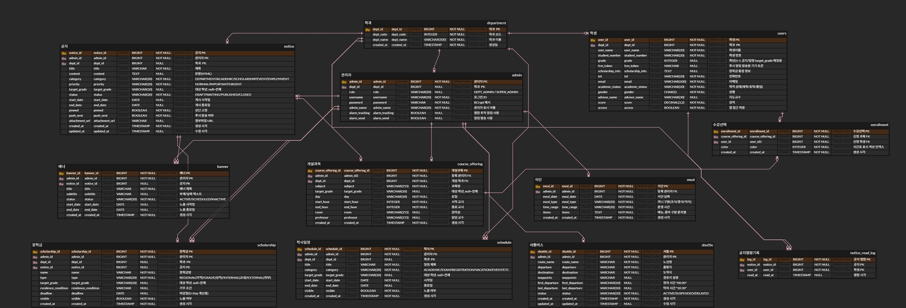

### 🏫 Department (학과)
| 필드명 | 타입 | 설명 |
|---|---|---|
| deptId | Long | PK |
| deptCode | Integer | 학과 코드 (unique) |
| deptName | String | 학과명 |

### 🔑 Admin (관리자)
| 필드명 | 타입 | 설명 |
|---|---|---|
| adminId | Long | PK |
| department | Department | 소속 학과 (SUPER_ADMIN은 null=전체) |
| role | String | SUPER_ADMIN / DEPT_ADMIN |
| username | String | 로그인 아이디 (unique) |
| password | String | 암호화 저장(BCrypt) |
| adminName | String | 관리자 이름 |
| alarmTracking / alarmSend | Boolean | 알림 설정 |

### 🎓 User (학생, 모바일 앱 사용자)
| 필드명 | 타입 | 설명 |
|---|---|---|
| userId | Long | PK |
| studentNumber | String | 학번 (unique, 모바일 로그인 식별자) |
| department | Department | 소속 학과 |
| userName / grade / tel / email | String/Integer | 기본 정보 |
| academicStatus | String | 재학/휴학/졸업 등 |
| access | Boolean | 앱 접근 허용 여부 |
| fcmToken | String | 푸시 알림 토큰 |
| score | BigDecimal | 성적 |

### 📢 Notice (공지)
| 필드명 | 타입 | 설명 |
|---|---|---|
| noticeId | Long | PK |
| admin / department | Admin/Department | 작성자, 대상 학과(null=전체) |
| title / content | String/Text | 제목/본문(HTML, jsoup 새니타이징) |
| category | String | DEPARTMENT/ACADEMIC/SCHOLARSHIP/EVENT/EMPLOYMENT |
| priority | String | NORMAL/IMPORTANT/URGENT |
| status | String | DRAFT/PUBLISHED/CLOSED |
| targetGrade / startDate / endDate | String/LocalDate | 대상 학년, 게시 기간 |
| pinned / pushSent | Boolean | 상단 고정, 푸시 발송 여부 |

### 🖼️ Banner (배너)
| 필드명 | 타입 | 설명 |
|---|---|---|
| bannerId | Long | PK |
| admin / notice | Admin/Notice | 작성자, 연결 공지(선택) |
| title / subtitle | String | 배너 문구 |
| status | String | ACTIVE/SCHEDULED/INACTIVE |
| startDate / endDate | LocalDate | 노출 기간 |

### 📅 Schedule (학사 일정)
| 필드명 | 타입 | 설명 |
|---|---|---|
| scheduleId | Long | PK |
| admin / department | Admin/Department | 작성자, 대상 학과 |
| title / category | String | 일정명/구분 |
| targetGrade | String | 대상 학년 |
| startDate / endDate | LocalDate | 일정 기간 |
| visible | Boolean | 학생 앱 노출 여부 |

### 🎓 Scholarship (장학금)
| 필드명 | 타입 | 설명 |
|---|---|---|
| scholarshipId | Long | PK |
| admin / department / notice | Admin/Department/Notice | 작성자, 대상 학과, 연결 공지 |
| name / type | String | 장학금명, 구분 |
| targetGrade / residenceCondition | String | 대상 학년, 거주 조건 |
| deadline | LocalDate | 신청 마감일 |
| visible | Boolean | 노출 여부 |

### 📚 CourseOffering (개설과목)
| 필드명 | 타입 | 설명 |
|---|---|---|
| courseOfferingId | Long | PK |
| admin / department | Admin/Department | 등록자, 개설 학과 |
| subject / professor / room | String | 과목명/교수/강의실 |
| targetGrade / day | String | 대상 학년, 요일 |
| startHour / endHour | Integer | 수업 시간 |

### 📝 Enrollment (수강신청)
| 필드명 | 타입 | 설명 |
|---|---|---|
| enrollmentId | Long | PK |
| user / courseOffering | User/CourseOffering | 신청 학생, 신청 과목 |
| color | Integer | 학생 앱 시간표 표시 색상 인덱스 |

### 🍚 Meal (식단)
| 필드명 | 타입 | 설명 |
|---|---|---|
| mealId | Long | PK |
| admin | Admin | 등록자 |
| mealDate / mealType | LocalDate/String | 날짜, 조식/중식/석식 |
| timeRange / items | String/Text | 운영 시간, 메뉴 |

### 🚌 Shuttle (셔틀버스, SUPER_ADMIN 전용)
| 필드명 | 타입 | 설명 |
|---|---|---|
| shuttleId | Long | PK |
| routeName / departure / destination / waypoints | String | 노선 정보 |
| firstDeparture / lastDeparture | String | 첫차/막차 시각 |
| status | String | 운행 상태 |

### 👀 NoticeReadLog (공지 열람 로그)
| 필드명 | 타입 | 설명 |
|---|---|---|
| logId | Long | PK |
| notice / user | Notice/User | 열람한 공지, 열람 학생 |
| readAt | LocalDateTime | 열람 시각 |

## ✨ 핵심 기능

### 1) 관리자 웹 (Thymeleaf, 세션 기반)
+ 공지/배너/학사일정/장학금/개설과목/식단/셔틀버스 CRUD, 권한 범위(SUPER_ADMIN 전체 / DEPT_ADMIN 본인 학과)별 데이터 필터링(`AdminScopeValidator`).
+ 공지 열람 트래킹 + 미확인자 재발송, 과목/식단 CSV 일괄 업로드.
+ CSRF(prod 활성화), CSP, 세션 쿠키 secure/sameSite, 접근 거부 시 flash 메시지 처리.

### 2) 모바일 REST API (`/api/**`, JWT 무상태 인증)
+ 학번 기반 로그인(`POST /api/auth/verify`) → ES256 서명 JWT 발급.
+ 시간표/수강신청, 식단, 개설과목, 공지, 배너, 학사일정, 장학금 조회.
+ 모든 요청은 `Authorization: Bearer <token>` 필요(로그인 제외), 에러는 `{"message": "..."}` 단일 포맷.

## 📌 API 명세표 (모바일 REST API)

| 분류 | 메서드/경로 | 설명 |
|---|---|---|
| 인증 | `POST /api/auth/verify` | 학번+이름+학과로 본인 확인 후 JWT 발급 |
| 내 정보 | `GET /api/users/me` | 로그인한 학생 정보 조회 |
| 식단 | `GET /api/meal/today` | 오늘의 식단 조회 |
| 개설과목 | `GET /api/courses` | 소속 학과 개설과목 목록 |
| 수강신청 | `POST /api/enrollments` | 과목 신청 (`courseOfferingId`) |
| 수강취소 | `DELETE /api/enrollments/{id}` | 신청 취소 |
| 시간표 | `GET /api/schedule/me` | 본인 시간표 조회 |
| 공지 | `GET /api/notices`, `GET /api/notices/{id}`, `POST /api/notices/{id}/view` | 목록/상세/열람 처리 |
| 배너 | `GET /api/banners` | 앱 메인 배너 |
| 학사일정 | `GET /api/academic-calendar` | 학사일정 목록 |
| 장학금 | `GET /api/scholarships`, `GET /api/scholarships/{id}` | 목록/상세 |


## 🔒 보안

+ **인증**: JWT ES256(ECDSA P-256) 비대칭 서명 — 개인키/공개키 분리, 서버 외부 유출돼도 위조 불가능한 구조.
+ **인가**: 전 리소스 SUPER_ADMIN/DEPT_ADMIN 권한 범위 검증(`AdminScopeValidator`) + URL 단위 역할 제한(`/shuttles`, `/meals`, `/enrollments`는 SUPER_ADMIN 전용).
+ **웹 보안**: CSRF(운영 프로파일 활성화), CSP, 세션 쿠키 secure/sameSite, Notice 본문 XSS 방지(jsoup 새니타이징 후 저장).
+ **의존성**: PostgreSQL 드라이버·Jackson 등 알려진 CVE 있는 버전은 직접 고정해서 패치(pom.xml). 정기적으로 재검증 필요.
+ **배포 엣지**: nginx에서 로그인/토큰 발급 엔드포인트 rate limit, `actuator`/`h2-console` 외부 차단, HSTS.
+ **비밀정보**: DB 비밀번호·JWT 키는 `.env`로만 관리하고 git에 커밋하지 않는다(`.gitignore` 처리됨).

## 🖼️ 페이지 구성

### 로그인
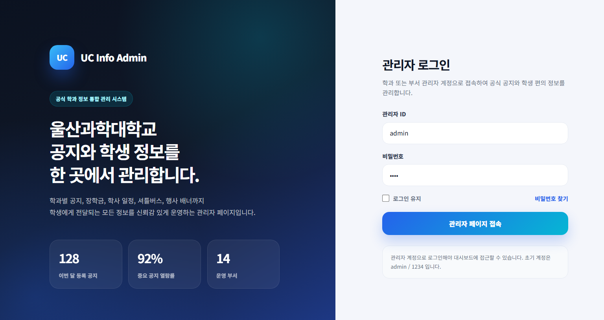

- 메인 담당자 : 한구윤
- 주요 개발 기능 : 세션 기반 관리자 로그인, 로그인 실패 시 에러 메시지 처리, 인증 성공 시 대시보드로 리다이렉트

---

### 대시보드
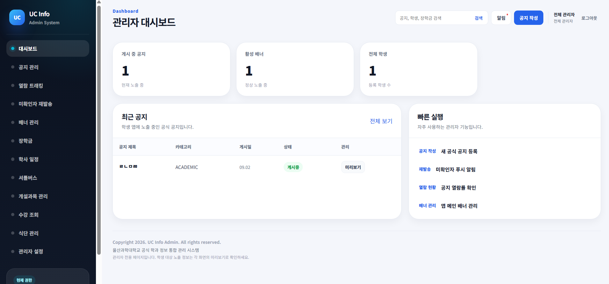

- 메인 담당자 : 박수민
- 주요 개발 기능 : 게시 중 공지·활성 배너·대상 학생 수 통계, 최근 공지 목록, SUPER_ADMIN/DEPT_ADMIN 권한 범위별 집계

---

### 공지 관리
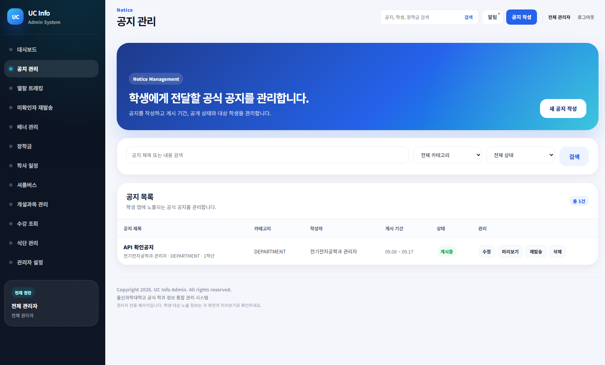
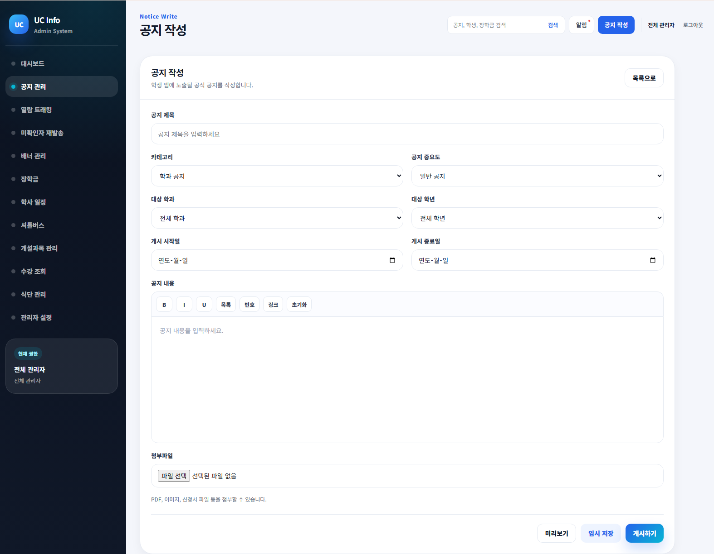

- 메인 담당자 : 박수민
- 주요 개발 기능 : 공지 CRUD, 카테고리/중요도/대상 학과·학년 지정, HTML 본문 XSS 새니타이징(jsoup), 상태(임시저장/게시/게시종료) 관리

---

### 열람 트래킹 / 미확인자 재발송
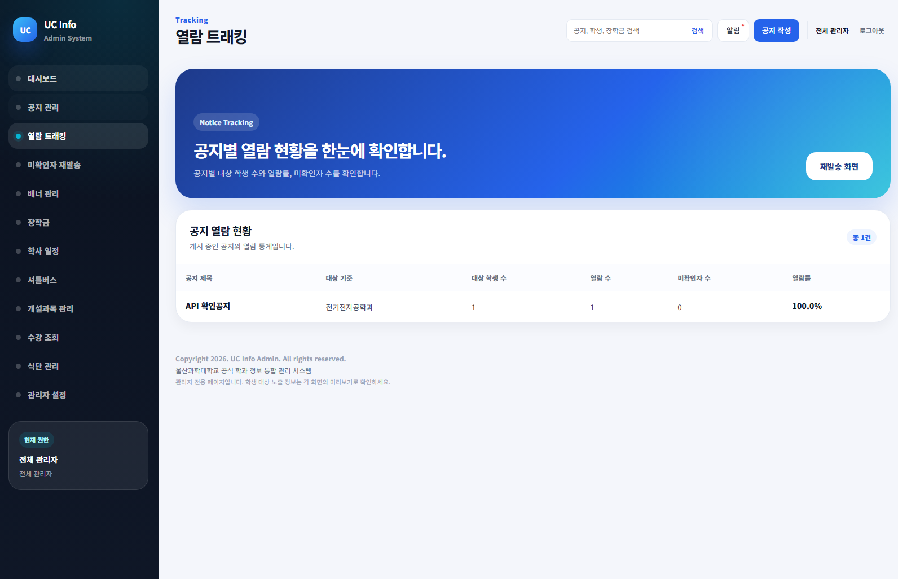


- 메인 담당자 : 한구윤
- 주요 개발 기능 : 공지별 대상 학생 수·열람률·미확인자 수 집계, 미확인 학생 대상 푸시 알림 재발송

---

### 배너 관리
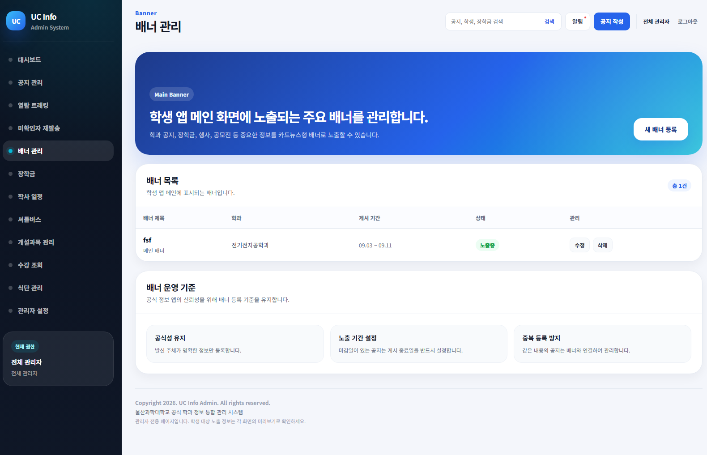
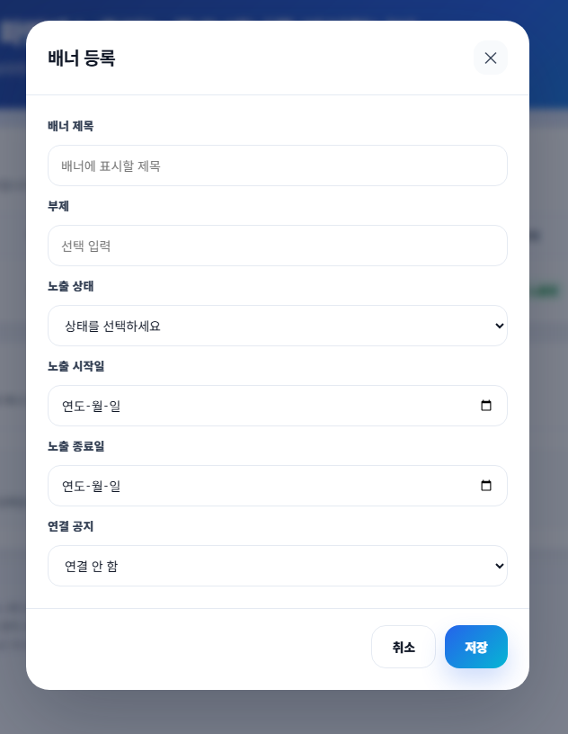

- 메인 담당자 : 한구윤
- 주요 개발 기능 : 앱 메인 배너 CRUD, 공지 연결(선택), 노출 기간·상태(ACTIVE/SCHEDULED/INACTIVE) 관리

---

### 학사 일정
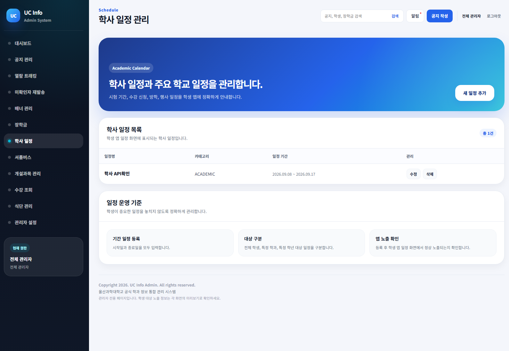


- 메인 담당자 : 박수민
- 주요 개발 기능 : 학사일정 CRUD, 대상 학과·학년 지정, 학생 앱 노출 여부 토글

---

### 장학금
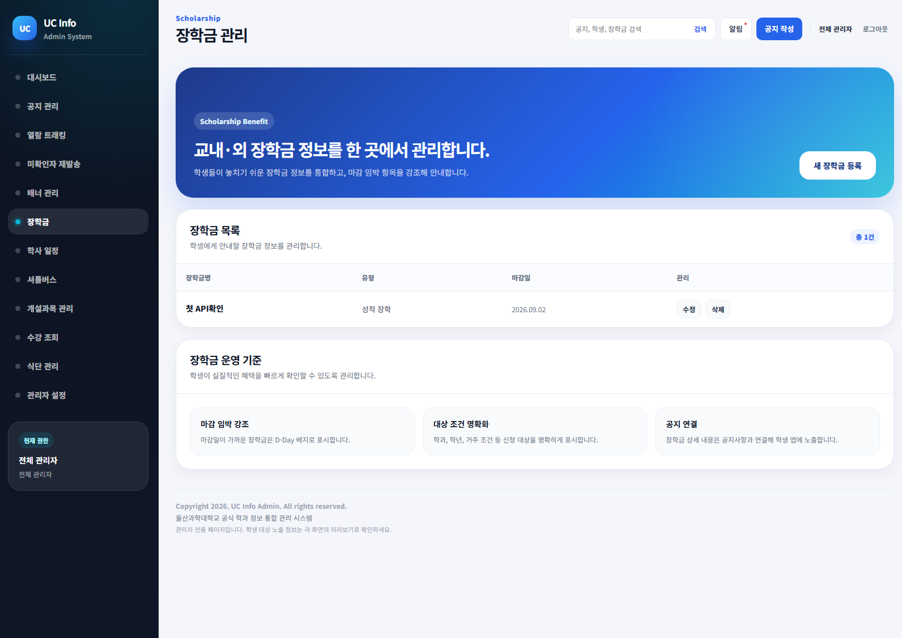
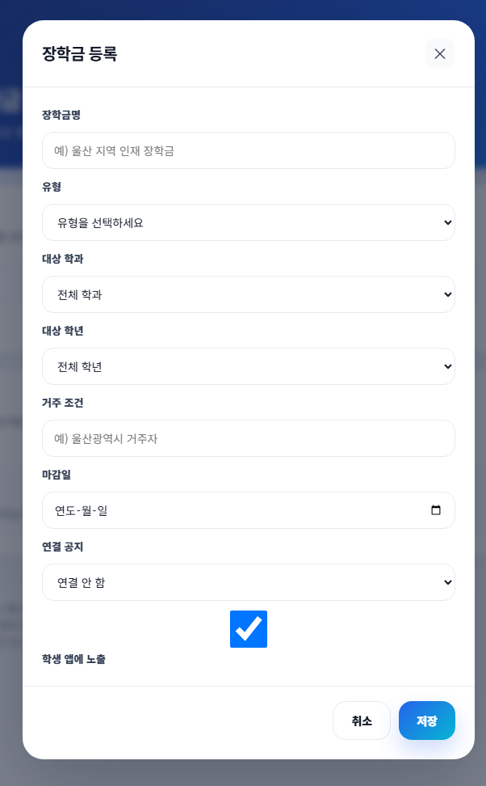

- 메인 담당자 : 한구윤
- 주요 개발 기능 : 장학금 CRUD, 유형(지역/성적/교내/교외) 및 대상 학년별 관리, 신청 마감일(D-Day) 관리

---

### 개설과목 관리
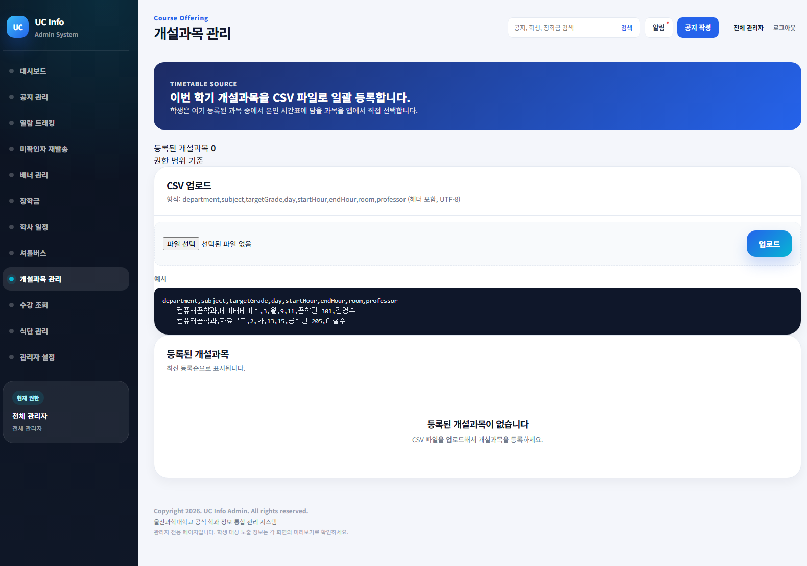

- 메인 담당자 : 손수호
- 주요 개발 기능 : 개설과목 CSV 일괄 업로드, 학과 스코프 검증(DEPT_ADMIN은 본인 학과만), 요일·시간·강의실·담당교수 관리

---

### 수강 조회
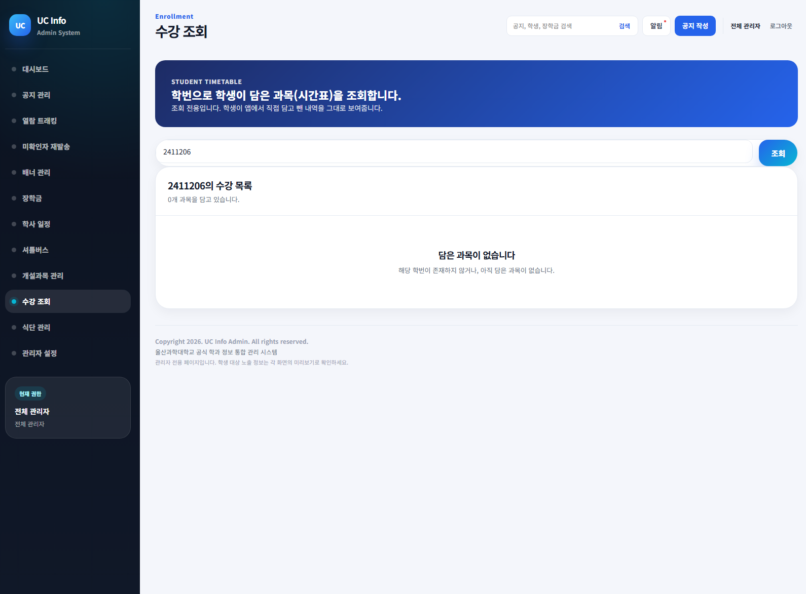

- 메인 담당자 : 손수호
- 주요 개발 기능 : 학번으로 검색해 해당 학생이 신청한 과목 전체 조회(SUPER_ADMIN 전용)

---

### 식단 관리


- 메인 담당자 : 손수호
- 주요 개발 기능 : 식단 CSV 일괄 업로드(끼니별 upsert), 날짜·끼니 조합 중복 방지, SUPER_ADMIN 전용 관리

---

### 셔틀버스 관리


- 메인 담당자 : 박수민
- 주요 개발 기능 : 셔틀 노선 CRUD(출발지/도착지/경유지/첫차·막차), 운행 상태(운행중/중단/지연) 관리, SUPER_ADMIN 전용

---

### 관리자 설정
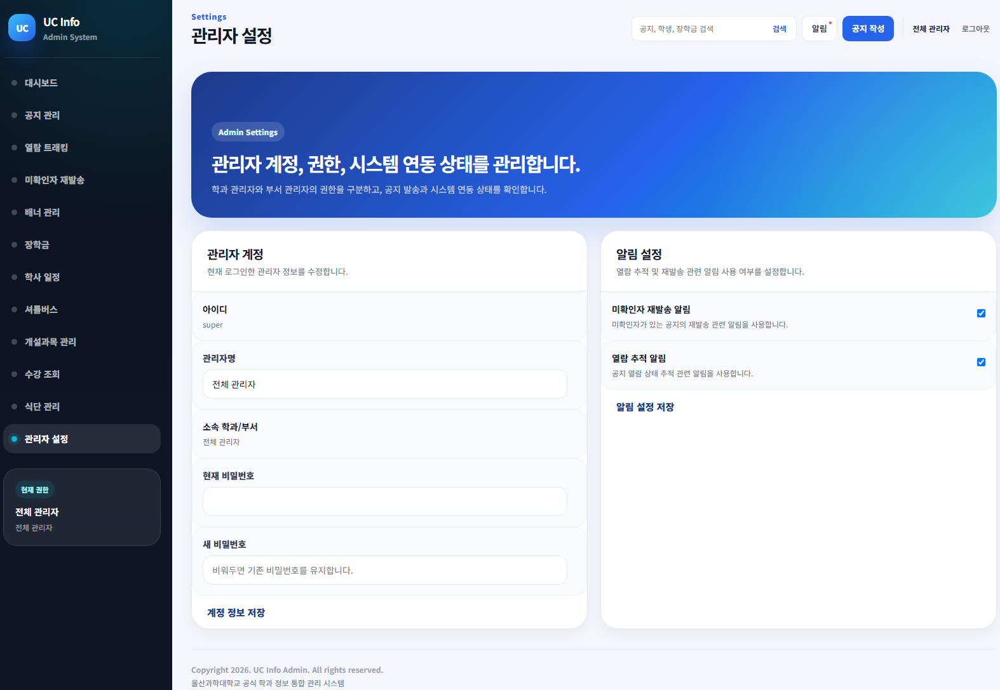

- 메인 담당자 : 박수민
- 주요 개발 기능 : 관리자 계정 비밀번호 변경(BCrypt), 열람 추적·알림 발송 설정 관리

## 📚 프로젝트 문서

+ [Notion](https://app.notion.com/p/UC-Info-9-23-319be056f6498093b27af7b5d82a308a?source=copy_link)